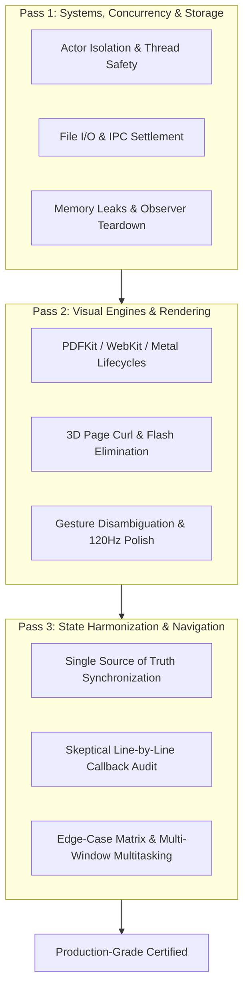

# Triple-Checked Code Review & Systems Defense Protocol

A formalized, multi-pass engineering review framework designed to systematically uncover subtle bugs, race conditions, memory leaks, navigation breaks, and UI/UX state desynchronizations before code reaches production.

---

## The Three Defense Review Passes

---

## 1. Review Pass 1: Systems, Concurrency, IPC & Storage

*Focus: Background execution, actor boundaries, sandbox security, cross-process staging, and memory lifecycle.*

### A. Actor Isolation & Thread Cleanliness

1. **Zero Main-Thread Blocking**:
   - Heavy operations (image decoding, archive decompression, full-document scanning, PDF rasterization, file settlement) **MUST NEVER** execute synchronously on `@MainActor`.
   - Offload heavy tasks to background actors (`LibraryScanner`, `ThumbnailDaemon`, `JITComicCacheEngine`) or `Task.detached(priority: .userInitiated)`.
2. **Swift 6 Sendable Concurrency**:
   - Models crossing actor boundaries must conform to `Sendable`.
   - Eliminate mutable shared state across asynchronous boundaries.

### B. IPC, App Group Staging & File Settlement

1. **SpringBoard Handover Protocol**:
   - For Share Extensions or Action Extensions, never call `extensionContext.completeRequest` immediately after triggering an external URL open. Always defer completion inside the `extensionContext.open()` completion callback.
2. **File Settlement Verification**:
   - When staging files from an external process, test for non-zero file size stability over a minimum delta (e.g. 150ms) using non-blocking `Task.sleep` to ensure incomplete byte writes are not prematurely ingested.
3. **Sandbox UUID Shifts**:
   - Persist relative document paths rather than absolute paths to guarantee resilience against iOS container UUID re-allocations during updates.
4. **Ingestion Concurrency & Queue Drain Loop**:
   - When an ingestion is already active (`isIngesting == true`), incoming share targets MUST be appended to a pending queue instead of dropped. An automatic follow-up pass must drain the queue upon completion.
5. **System Sandbox Inbox Hygiene**:
   - Direct file opens handed via system `Documents/Inbox/` must be cleaned up after successful ingestion to `InksyncVault/Inbox` to prevent disk bloat.

### C. Resource Safety & Teardown

1. **Observer Dismantling**:
   - Explicitly remove NotificationCenter observers and KVO delegates in `dismantleUIView` / `dismantleUIViewController` / `deinit`.
2. **WebKit Message Handler Cleanup**:
   - Remove script message handlers (`removeScriptMessageHandler(forName:)`) on `WKUserContentController` during view teardown to prevent circular retain leaks.

### D. Comprehension Debt & Code Churn Prevention (AI Economics Audit)

1. **Zero Copy-Paste Proliferation**:
   - Reject changes that duplicate logic, file parsing, or gesture handling into multiple components. Force extraction into shared, testable utilities.
2. **Deep Semantic Protocols (Cognitive Compression)**:
   - Verify that new subsystems expose clean protocols with minimal public surface area (deep modules) rather than sprawling concrete dependencies (shallow modules).
3. **Comprehension Audit**:
   - Verify that every AI-generated block is concise, self-documenting, and explainable at the semantic level. If code is cryptic or excessively verbose, refactor before certification.

---

## 2. Review Pass 2: Visual Engines & Rendering Pipelines

*Focus: PDFKit vector geometry, WebKit reflow, Metal canvas layers, 3D page curl physics, and gesture isolation.*

### A. PDFKit Vector Geometry & Zoom Clamping

1. **Fit-Scale Clamping**:
   - Calculate baseline fit scale via `pdfView.scaleFactorForSizeToFit`.
   - Set `minScaleFactor = fitScale` (never < 0.25) and `maxScaleFactor = fitScale * 7.0` on both `PDFView` and its underlying `UIScrollView` to prevent scale inversion or white-screen bugs.
2. **Column-Aware Smart Zoom**:
   - Disambiguate single-tap vs double-tap gestures with `tapGesture.require(toFail: doubleTap)`.
   - Analyze character bounding boxes via column detectors to center double-tap zoom directly over multi-column reading blocks.

### B. PDFKit Inking Lifecycle & Gesture Stealing Defense (iOS 16+)

1. **Early Provider Binding**:
   - `pdfView.pageOverlayViewProvider` MUST be assigned in `makeUIView` **before** `pdfView.document = document`. Late binding fails to query overlays on visible page 0.
2. **Scroll View Gesture Isolation**:
   - Whenever inking is active, configure `pdfView.scrollView.panGestureRecognizer.minimumNumberOfTouches = 2`. This guarantees 1-finger Apple Pencil and touch drawing strokes are never stolen or cancelled by scroll gestures, while 2-finger pans navigate the canvas.
3. **Markup Mode Suppression**:
   - Set `pdfView.isInMarkupMode = true` during drawing to disable text loupe capture. Suppress reader tap gestures (`tapGesture.isEnabled = !isMarkupActive`) so rapid stippling and dotting never flip pages.
4. **Device-Idiom Inking Gating**:
   - Ensure finger inking is unconditionally enabled on iPhone (`!isPad`), and enabled on iPad unless "Apple Pencil Drawing Only" is explicitly enabled in Settings.

### C. Text Highlighting & Selection Standard (Kindle / Apple Books Parity)

1. **Zero Auto-Commit Highlights in `selectionChanged`**:
   - Selection notifications must purely update state to drive HUD presentation. Never place asynchronous debounce tasks in `selectionChanged` that unilaterally stamp highlights.
2. **Dual Selection Pathways**:
   - Fast-path dedicated stylus highlighter commits on `.ended` with `defaultHighlightColor`; standard reader selection displays the floating HUD (Color palette, Copy, Note, Translate, Speak).
3. **Annotation Hit-Testing & Mutation**:
   - Tapping existing highlights must hit-test the annotation, display the HUD with its active color, and allow color changes or deletion with zero duplicate highlight stamps.
4. **Per-Line Quad Polygons**:
   - Reconstruct stored highlights using `selectionsByLine()` for saved text, generating tight per-line quads via `PDFHighlightGeometryHelper.createQuadPoints(for: validRects, relativeTo: unionBox)` so multi-line text never degenerates into a solid block upon reload.

### D. WebKit Multi-Column EPUB Reflow & Snapshot Lifecycle

1. **Invariant Viewport Model**:
   - Enforce `position: relative !important; width: 100vw !important; height: 100vh !important; box-sizing: border-box !important;`.
2. **Mathematical Zero-Drift Column Stride**:
   - Calculate $\text{colWidth} = (\text{renderWidth} / \text{cols}) - 2m$ and $\text{gap} = 2m$, guaranteeing $\text{colWidth} + \text{gap} = \text{pageWidth}$ so every page turn lands with pixel-perfect margin alignment.
3. **Structural Layout Preservation**:
   - Avoid destructive global CSS resets (`display: block !important; position: static !important;`). Protect page breaks with `break-inside: avoid !important` on images, figures, tables, and code blocks, and `break-after: avoid !important` on headings.
4. **Failsafe Snapshot Lifecycle**:
   - Retain the primary webview during `willTransitionTo` in `UIPageViewController` to eliminate blank page flashes during page curls.
5. **Wrapper Idempotency**:
   - Guard `wrapHTMLBodyWithViewport` against duplicate nested `#inksync-viewport` wrapping.

### E. 3D Page Curl & Flash Elimination

1. **Frame-0 Image Pre-Caching**:
   - Curled transition pages must pre-cache uncompressed frame-0 image bitmaps so 3D page curl animations execute immediately from memory with zero blank/white flash.
2. **Spread Splitting (`CropHalf`)**:
   - Dynamically handle two-up splash pages with geometry offsets (`offset(x: cropHalf == .left ? 0 : -width)`) respecting LTR vs RTL reading directions.

### F. ProMotion 120Hz, Touch Ergonomics & Gesture Isolation

1. **Touch Non-Cancellation & Apple HIG Targets (≥ 44pt)**:
   - Set `cancelsTouchesInView = false` on top-level gestures so child elements (hyperlinks, text selections, sliders) remain responsive.
   - All drag handles, partition lines, and resize corners MUST provide an invisible touch hit corridor of at least $44\times 44\text{ pt}$ (`Color.clear.contentShape(Rectangle())`).
2. **Gesture Layer Z-Index Hierarchy**:
   - Ensure tap-gesture containers (e.g., sequence badge hitboxes) do not sit above draggable divider lines or resize handles, which steals drag touches.
3. **Start-Relative Drag Math**:
   - Verify that `DragGesture.onChanged` applies offset relative to the state at gesture start (`dragStartValue + translation`), rather than compounding cumulative translation deltas into runaway jitter.
4. **Micro-Interaction Polish**:
   - Pair tactile `HapticEngine` feedback (`.light()`, `.medium()`, `.selection()`) with spring physics animations (`.spring(response: 0.3, dampingFraction: 0.8)`).

---

## 3. Review Pass 3: State Harmonization, Navigation & Zero-Assumption Audit

*Focus: End-to-end user flows, presentation bindings, deep links, and edge-case verification.*

### A. Skeptical Zero-Assumption Audit

1. **Never Assume Functional Integration**:
   - Never claim a toolbar button, menu option, or gesture handler works simply because a UI symbol or state variable exists.
2. **Trace the Complete Action Chain**:
   - Explicitly verify: `UI Button` ➔ `Action Callback` ➔ `@State / @Binding Toggle` ➔ `Modal Sheet / AppRouter Presenter`.
3. **Verify Modal Presenter & Content**:
   - Ensure every `.sheet`, `.popover`, and `.fullScreenCover` is backed by a valid non-nil binding and passes all required environment objects.

### B. Navigation, Deep-Link Bridging & Presentation Concurrency

1. **AppRouter Presentation Idempotency**:
   - Verify that `AppRouter.presentFullScreen(_:)` checks whether the requested document is already actively presented; if so, it must return immediately to prevent presentation dismissal flashes.
   - For distinct destinations, enforce a `0.35s` delay to allow UIKit to finish dismissing prior full-screen modal covers.
2. **External Open Auto-Selection**:
   - Ensure newly ingested external files (Share Extension, "Open With", AirDrop) bridge their selected state (`selectedPDF`) directly to the active presentation router (`AppRouter.presentFullScreen(.read(pdf))`) so the document immediately opens for the user.
3. **Spotlight & Universal Links**:
   - Route `NSUserActivity` and `onOpenURL` through `UniversalLinkBridge` to restore exact chapter and page indices. Verify that `.onOpenURL` is attached once at the root view rather than duplicated in both `WindowGroup` and child views.
4. **Reading HUD Progress Mode Harmonization**:
   - Verify that discrete Smart Tier badges (e.g. `· Tier 2/4`) remain displayed across all reading progress display modes (Pages Left, Time Left, and WPM) in `InksyncProgressFooterView`.

### C. Multi-State Edge-Case Matrix

Always test features across 4 essential runtime conditions:

1. **Cold Launch & Frame-0 Cache Seeding**:
   - First run with empty cache or fresh install sentinel check. Ensure managers and singletons (`ConversionManager`) synchronously populate initial cache projections (`rebuildVisiblePDFs()`) in their initializers so the very first frame renders the user's library without empty shelf flicker.
2. **Zoomed In State (1.0x – 3.5x)**: Pan gestures and boundary constraints while zoomed.
3. **Dynamic Device Rotation**: Switching Portrait ↔ Landscape across single and dual page spreads.
4. **Low Memory Warnings**: Memory eviction of image caches without crashing the active reader session.

### D. Use-Case Permutations & Fault Boundaries (Banerjee Protocol)

1. **Input Permutation Matrix**:
   - For every input (file URLs, bookmarks, user settings, page offsets), explicitly verify behavior under 3 states:
     - (a) **Valid Input**: Normal execution and expected state update.
     - (b) **Invalid / Malformed Input**: Handled gracefully with explicit typed errors (never crashing or leaving inconsistent UI).
     - (c) **Missing / Nil Input**: Fallback defaults or graceful dismissal without dangling loaders.
2. **Fault Isolation**:
   - Ensure an error in a secondary component (e.g., thumbnail generation, dominant color extraction) never halts primary reading or document viewing.
