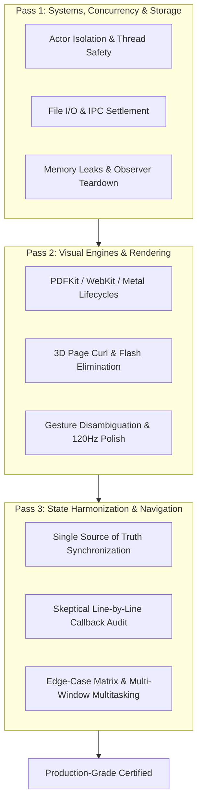

# Triple-Checked Code Review & Systems Defense Protocol

A formalized, multi-pass engineering review framework designed to systematically uncover subtle bugs, race conditions, memory leaks, navigation breaks, and UI/UX state desynchronizations before code reaches production.

---

## The Three Defense Review Passes

---

## 1. Review Pass 1: Systems, Concurrency, IPC & Storage

*Focus: Background execution, actor boundaries, sandbox security, cross-process staging, and memory lifecycle.*

### A. Actor Isolation & Thread Cleanliness
1. **Zero Main-Thread Blocking**:
   - Heavy operations (image decoding, archive decompression, full-document scanning, PDF rasterization, file settlement) **MUST NEVER** execute synchronously on `@MainActor`.
   - Offload heavy tasks to background actors (`LibraryScanner`, `ThumbnailDaemon`, `JITComicCacheEngine`) or `Task.detached(priority: .userInitiated)`.
2. **Swift 6 Sendable Concurrency**:
   - Models crossing actor boundaries must conform to `Sendable`.
   - Eliminate mutable shared state across asynchronous boundaries.

### B. IPC, App Group Staging & File Settlement
1. **SpringBoard Handover Protocol**:
   - For Share Extensions or Action Extensions, never call `extensionContext.completeRequest` immediately after triggering an external URL open. Always defer completion inside the `extensionContext.open()` completion callback.
2. **File Settlement Verification**:
   - When staging files from an external process, test for non-zero file size stability over a minimum delta (e.g. 150ms) using non-blocking `Task.sleep` to ensure incomplete byte writes are not prematurely ingested.
3. **Sandbox UUID Shifts**:
   - Persist relative document paths rather than absolute paths to guarantee resilience against iOS container UUID re-allocations during updates.

### C. Resource Safety & Teardown
1. **Observer Dismantling**:
   - Explicitly remove NotificationCenter observers and KVO delegates in `dismantleUIView` / `dismantleUIViewController` / `deinit`.
2. **WebKit Message Handler Cleanup**:
   - Remove script message handlers (`removeScriptMessageHandler(forName:)`) on `WKUserContentController` during view teardown to prevent circular retain leaks.

---

## 2. Review Pass 2: Visual Engines & Rendering Pipelines

*Focus: PDFKit vector geometry, WebKit reflow, Metal canvas layers, 3D page curl physics, and gesture isolation.*

### A. PDFKit Vector Geometry & Zoom Clamping
1. **Fit-Scale Clamping**:
   - Calculate baseline fit scale via `pdfView.scaleFactorForSizeToFit`.
   - Set `minScaleFactor = fitScale` (never < 0.25) and `maxScaleFactor = fitScale * 7.0` on both `PDFView` and its underlying `UIScrollView` to prevent scale inversion or white-screen bugs.
2. **Column-Aware Smart Zoom**:
   - Disambiguate single-tap vs double-tap gestures with `tapGesture.require(toFail: doubleTap)`.
   - Analyze character bounding boxes via column detectors to center double-tap zoom directly over multi-column reading blocks.

### B. 3D Page Curl & Flash Elimination
1. **Frame-0 Image Pre-Caching**:
   - Curled transition pages must pre-cache uncompressed frame-0 image bitmaps so 3D page curl animations execute immediately from memory with zero blank/white flash.
2. **Spread Splitting (`CropHalf`)**:
   - Dynamically handle two-up splash pages with geometry offsets (`offset(x: cropHalf == .left ? 0 : -width)`) respecting LTR vs RTL reading directions.

### C. ProMotion 120Hz & Gesture Disambiguation
1. **Touch Non-Cancellation**:
   - Set `cancelsTouchesInView = false` on top-level gestures so child elements (hyperlinks, text selections, sliders) remain responsive.
2. **Micro-Interaction Polish**:
   - Pair tactile `HapticEngine` feedback (`.light()`, `.medium()`, `.selection()`) with spring physics animations (`.spring(response: 0.3, dampingFraction: 0.8)`).

---

## 3. Review Pass 3: State Harmonization, Navigation & Zero-Assumption Audit

*Focus: End-to-end user flows, presentation bindings, deep links, and edge-case verification.*

### A. Skeptical Zero-Assumption Audit
1. **Never Assume Functional Integration**:
   - Never claim a toolbar button, menu option, or gesture handler works simply because a UI symbol or state variable exists.
2. **Trace the Complete Action Chain**:
   - Explicitly verify: `UI Button` ➔ `Action Callback` ➔ `@State / @Binding Toggle` ➔ `Modal Sheet / AppRouter Presenter`.
3. **Verify Modal Presenter & Content**:
   - Ensure every `.sheet`, `.popover`, and `.fullScreenCover` is backed by a valid non-nil binding and passes all required environment objects.

### B. Navigation & Deep-Link Bridging
1. **External Open Auto-Selection**:
   - Ensure newly ingested external files (Share Extension, "Open With", AirDrop) bridge their selected state (`selectedPDF`) directly to the active presentation router (`AppRouter.presentFullScreen(.read(pdf))`) so the document immediately opens for the user.
2. **Spotlight & Universal Links**:
   - Route `NSUserActivity` and `onOpenURL` through `UniversalLinkBridge` to restore exact chapter and page indices.

### C. Multi-State Edge-Case Matrix
Always test features across 4 essential runtime conditions:
1. **Cold Launch**: First run with empty cache or fresh install sentinel check.
2. **Zoomed In State (1.0x – 3.5x)**: Pan gestures and boundary constraints while zoomed.
3. **Dynamic Device Rotation**: Switching Portrait ↔ Landscape across single and dual page spreads.
4. **Low Memory Warnings**: Memory eviction of image caches without crashing the active reader session.
