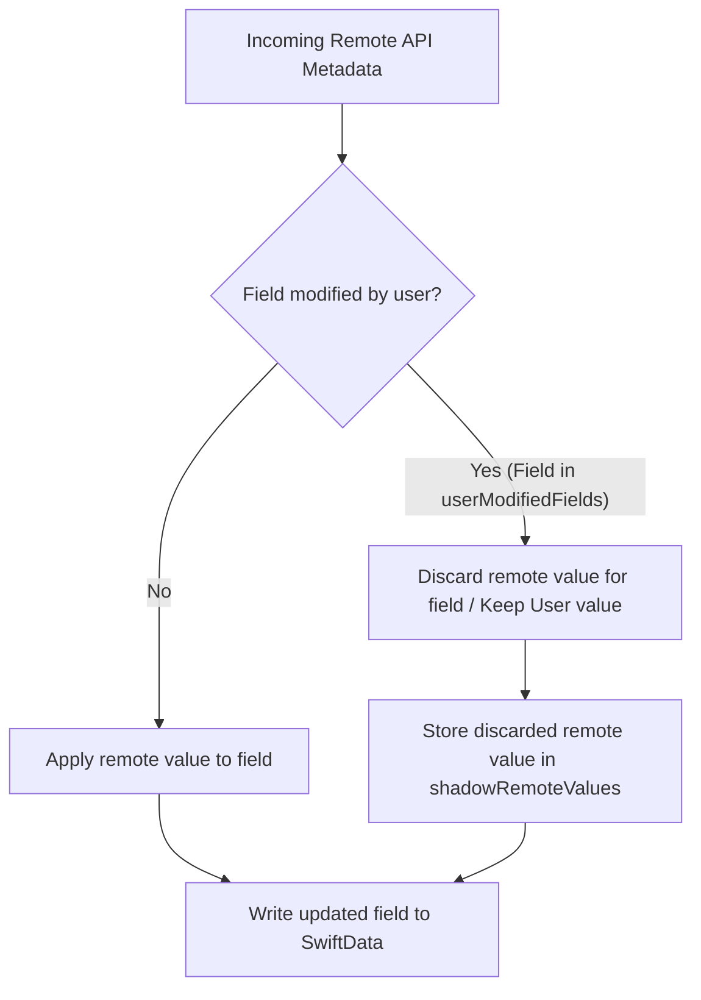
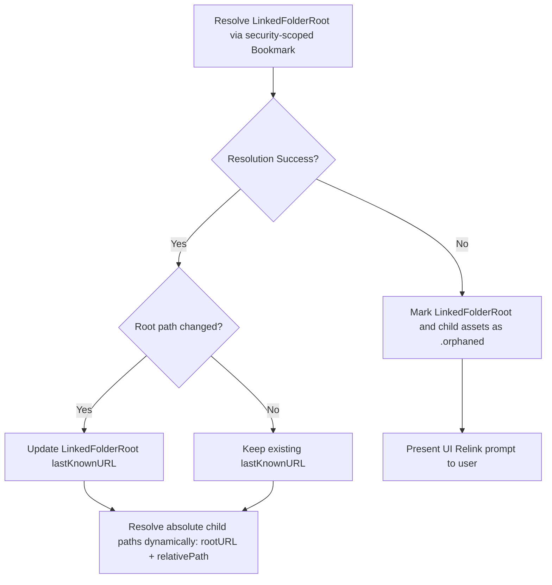
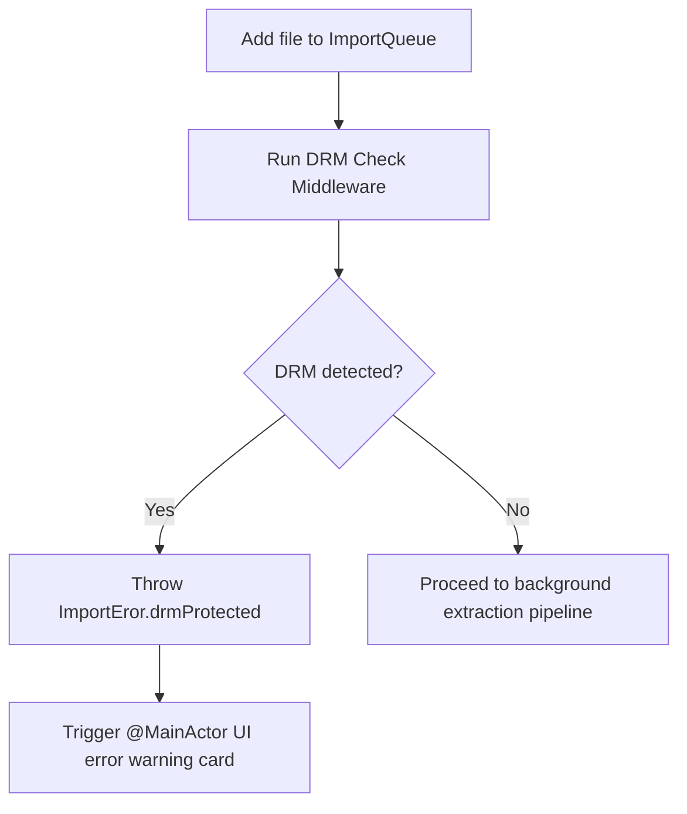
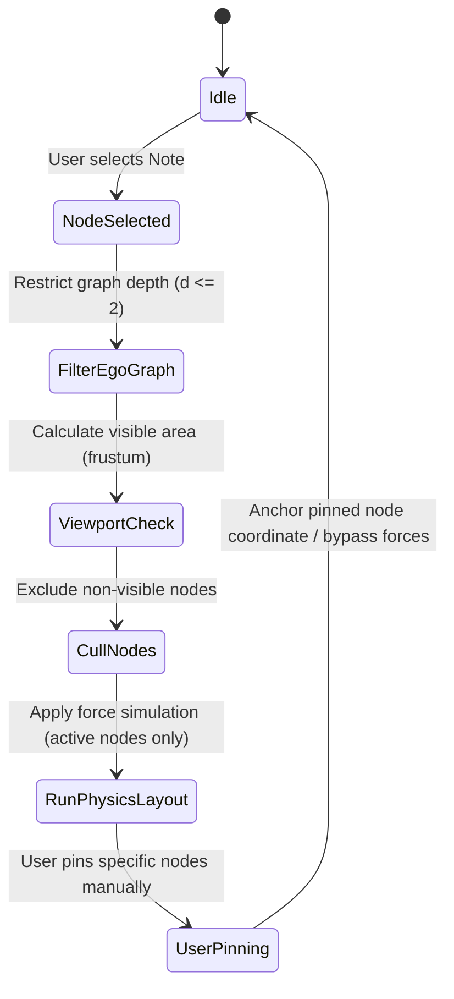
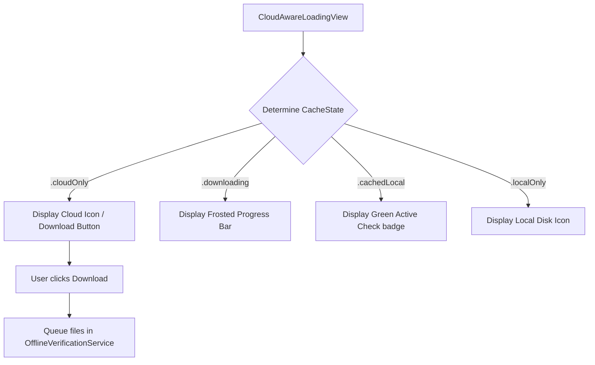
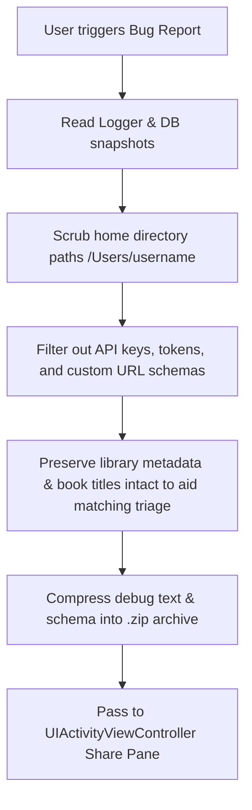

# InksyncPro Product Bible

**Last Updated:** August 1, 2026

---

## Product Vision

InksyncPro is the premier, state-of-the-art iOS/iPadOS comic and manga reading platform. It is designed to bridge the gap between casual reading and professional, high-performance study and annotation. The application seamlessly integrates local, iCloud, and external storage (Dropbox) without sacrificing performance or aesthetics.

The user experience philosophy: **the app should feel like a beautifully crafted home, not a distracted utilitarian tool.** Every surface, animation, and interaction must feel like it was designed for the modern age.

---

## Core Pillars

1. **Uncompromising Aesthetics:** A modern, premium, frosted-glass UI with rich micro-animations that rivals or exceeds any first-party Apple application or top-tier competitor (e.g., Panels, Comic Zeal).

2. **Robust Data Integrity & Sentinel Security:** Cloud-first, non-destructive architecture with strict lifecycle management. Features an `InstallGuardService` utilizing a non-synced Sentinel file (`.inksync_install_sentinel_v1`) stored in the local `Application Support` directory to accurately detect clean installations versus app updates. Wipes ghost files synced by iCloud in the public `Documents` directory upon fresh installs, avoiding Vault-based copy mechanisms that cause storage bloat and compiler debt.

3. **High-Performance Architecture (App-Wide 60fps Target):** Swift 6 concurrency compliance, background-threaded extraction, and robust memory management preventing OOM crashes. To deliver a fluid, uncompromising user experience, the entire application strictly targets a minimum of 60fps (and native ProMotion 120fps on compatible hardware) across all interfaces—including library grid scrolling, search fields, sheet transitions, and reader views. This is achieved by moving all heavy disk/network operations completely off the main thread. The conversion pipeline utilizes `O(1)` memory disk streaming for massive `.cbz` payloads to bypass `JetsamEvent` kills. The reader uses `CGImageSourceCreateThumbnailAtIndex` for professional image downsampling during the I/O read phase, a custom LRU `NSCache` with `maxCacheSize = 7` to restrict the memory footprint to ~15MB, and asynchronous prefetching tasks (`±2` pages around the active page) to ensure seamless reading performance.

4. **Crash-Free Import & Conversion Pipeline:** Every import operation opens security-scoped resource access explicitly before touching user-selected files. Heavy I/O (ZIP packaging, RAR extraction) is always moved off the Swift cooperative thread pool via `DispatchQueue.global` + `withCheckedThrowingContinuation`. All temporary directories are strictly cleaned up with `defer` regardless of outcome, preventing SSD bloat and subsequent I/O failures.

5. **Diagnostic Telemetry Engine:** `MemoryMonitor` runs a persistent 2-second heartbeat checking `os_proc_available_memory()`. If RAM drops below critical thresholds, it triggers aggressive cache purges. Full crash analytics and memory telemetry are logged locally to `.ips` and `.json` formats for debugging without compromising user privacy.

6. **Future Extensibility:** Architecture designed to support Zettelkasten integrations, advanced markdown exports, and precision page editing tools in future iterations (currently prepared in `V2_Archive`).

---

## Feature Architecture

### 1. Library & Organization

- **Modern Grid & List:** High-performance SwiftData-backed library views featuring dynamic sorting (Date Added, Title, Size, Favorites, Type, Extension Type, Location) and live filtering (Unread, Reading, Completed, On Drive, Cloud).
- **Direct Card & Folder Sorting:** Dynamic rebuilding cache logic directly sorts the list representation (`LibraryListItem`) to prevent empty custom folders from clustering at the top. Alphabetical name sorting and chronological date sorting use actual title checks and `lastModified` timestamps rather than reversed index hacks.

- **Apple Books-Style Content Shelves:** Persisted shelf selector tab strip (All / Comics / Manga / Books) featuring custom icons, label names, live item count badges, accent colors (Blue, Red-Orange, Teal), and micro-animated scale transitions.

- **Smart Collections Engine:** Dynamic, rule-based filtering accessible via an elegant "overflow strip" in the library header. Predefined collections include:
  - *Recently Added* (Top 50 newest additions)
  - *Reading Now* (In-progress items, sorted by last opened)
  - *All Unread* (Untouched items)
  - *Manga Mode* (Items flagged for right-to-left reading)
  - *Completed* (Finished items)

- **Smart Series Grouping:** Automatic grouping of issues by parsed metadata or folder structure, with support for nested collections, manual sort orders, and automatic cover assignment.

---

### 2. The Guided Reading Experience

- **ReaderProgressTracker:** The single source of truth for reading telemetry, page tracking, reading streaks, and last-opened timestamps. Synced across devices via iCloud.

- **Reading Mode Quick Picker:** A bottom-anchored frosted capsule that pops up on swipe-up gestures when the chrome is hidden, letting users instantly switch and persist per-book layouts:
  - *Normal* (Horizontal LTR page turns)
  - *Manga* (Native RTL reading and tracking)
  - *Webtoon* (Continuous vertical scrolling with page redraw isolation and **off-screen image disposal via `.onDisappear` cell recycling** to keep memory consumption at an active $O(1)$ footprint)

- **Panel Navigation (Guided View):** Intelligent, Vision-framework-powered panel detection (`EnsemblePanelDetector`). Provides a curated, panel-by-panel guided reading experience with graceful fallbacks and frosted HUD overlays. **Pure-Text Safety:** If a page contains a high concentration of text blocks (15+) and no detected structural rectangles, it is classified as a pure text/index page and panel segmentation is skipped, allowing it to be read intact as a full-page spread.

- **Manga Native:** Fully supports right-to-left orientation and specifically tracks books requiring this mode.

- **Premium PDF Paging & Transitions:** The PDF reader dynamically configures its display layout according to the user's `EBookPaginationMode` preference. When `paged` is active, it utilizes a horizontal single-page view controller layout (`pdfView.usePageViewController(true)`) with native horizontal slide/page curl transitions and animated edge taps (`goToNextPage` / `goToPreviousPage`), syncing cleanly with `.PDFViewPageChanged` notifications.
- **EPUB Chapter Paging & Transition Safety:** The EPUB reader corrects page backward offsets by checking `currentOffset <= 4` (rather than projected offsets) before loading a preceding chapter. On chapter change, it sets `scrollToLastPageOnLoad = true` to cleanly land on the final page of that chapter.
- **Strict Table of Contents Integrity:** The EPUB metadata parser assigns an empty label (`""`) to any spine section that does not carry an explicit mapping in the book's Table of Contents. Drawer outlines automatically filter out empty labels (or fall back to sequential `"Chapter X"` counters if no TOC exists), while annotation highlights store `nil` titles to trigger safe `"Page X"` fallbacks in the global notebook.
- **Full-Screen Dual-Page Spread Spanning:** Dual-page 2-up page curl engine (`SmartMidSpineCurlReader`) dynamically detects landscape double-page spreads (`isL`) and crops left 50% (`cropHalf = .left`) for the left leaf and right 50% (`cropHalf = .right`) for the right leaf. Spreads span full-screen across both viewable sections of the median line seamlessly during 3D page curl transitions.
- **Sentinel Page Index Clamping:** Sentinel page navigation indices (e.g., `99999` passed when jumping backwards between EPUB chapters) are dynamically clamped in `EBookPageCurlReader.makePageViewController(for:)` to `max(0, computedTotalPages - 1)`. Page controllers instantiate strictly within valid chapter bounds, eliminating page-turning stuck/snapping loops.
- **Highlight Single-Source Persistence & Study Notebook Sheet Access:** `AnnotationStore.shared.add` operates as the single source of truth for SwiftData highlight creation, eliminating duplicate database entries. The reader view integrates `.sheet(isPresented: $showAnnotations)` displaying `StudyNotebookView` listening for `.toggleStudyNotebook` notifications from the HUD menu.
- **UIPageViewController Lifecycle Crash Defense:** Page curl readers synchronously execute `setViewControllers([initialVC], direction: .forward, animated: false)` before returning hosting view controllers to SwiftUI representable containers, preventing uninitialized Objective-C exceptions (`_viewControllersForPendingSpineLocation:` crash).
- **EPUB Fixed-Layout Comic Dynamic Routing**: Dynamic routing check inside `UnifiedReaderView.swift` (`isEPUBComic(url:)`). If an EPUB contains fixed-layout, pre-paginated, or image-based digital comic metadata properties inside its OPF manifest, the reader bypasses the flow-text `BookReaderEngine`/`DocumentReaderEngine` and maps the document directly to `ComicReaderEngine`. This ensures that dual-page view (spread layouts), fit modes, reading speed, and landscape layouts work identically to standard `.cbz`/`.cbr` files.

---

### 3. E-Ink Conversion & Optimization Pipeline

#### 3.1 Resolution-Aware Scaling (`EInkOptimizer`)

Downsamples images using aspect-fit rendering to match target e-reader profiles:

| Device | Resolution | Notes |
| --- | --- | --- |
| Kindle Scribe Colorsoft 11" | 1980 × 2640 px (300 PPI) | Primary target |
| Kindle Scribe Colorsoft 7" | 1264 × 1680 px (300 PPI) | |
| Kindle Paperwhite | 1236 × 1648 px (300 PPI) | |
| Kobo Elipsa | 1404 × 1872 px (227 PPI) | |
| Boox Note Air | 1404 × 1872 px (227 PPI) | |

Features dynamic orientation-aware scaling to rotate spreads for landscape screens.

#### 3.2 EPUB Output — Kindle Compliance Standard

All EPUBs produced by `CBZToEPUBConverter` and `EPUBManifestBuilder` **must** conform to the following rules to pass both sideloading (AZW3) and Send to Kindle cloud conversion (KFX) without E013 / E999 errors:

##### CSS — Approved Subset Only

```css
/* ✅ ALLOWED */
@page { margin: 0; padding: 0; }
html, body { margin: 0; padding: 0; width: 100%; height: 100%; background-color: #000000; }
.page { width: 100%; height: 100%; }
img { display: block; width: 100%; height: 100%; }

/* ❌ BANNED — causes E013 on Send to Kindle cloud converter */
/* position: fixed          — not in KF8/KFX CSS subset */
/* overflow: hidden          — not in Kindle CSS subset */
/* @media amzn-kf8          — proprietary at-rule, rejected by cloud XML validator */
/* @media amzn-kfx          — proprietary at-rule, rejected by cloud XML validator */
/* @page { size: ... }      — CSS Paged Media L3, rejected by Amazon cloud validator */
/* object-fit: contain      — not in Kindle CSS subset */
/* object-position: center  — not in Kindle CSS subset */
```

**Page sizing** is controlled entirely by `<meta name="viewport" content="width=1980, height=2640"/>` and the `rendition:layout pre-paginated` OPF metadata — never by `@page { size }`. *Critically, viewport tags must NOT include `initial-scale=1.0`, as this triggers E013 rendering kernel panics and screen bricking on older Kindle firmware.*

**Cover page** body element must carry `epub:type="cover"`:

```html
<body epub:type="cover"></body>
```

**Dual-page (landscape) spreads** are handled by `rendition:spread auto` in the OPF — do not generate custom two-page XHTML. Kindle Scribe Colorsoft renders spreads natively in landscape when the OPF declares `rendition:spread auto`.

**Manga RTL** is declared via `<spine page-progression-direction="rtl">` in the OPF — do not rely on CSS `direction: rtl` as Kindle ignores it for page-turn direction.

#### 3.3 Other Conversion Features

- **Asymmetric Binding Margins:** Generates gutter space padding (Left, Right, or Alternating Odd/Even) at the native device resolution to offset physical bindings.

- **Auto-Cropping:** Scans `CGImage` pixel thresholds to strip blank/white borders before scaling, maximizing the active artwork area.

- **Moiré Reduction:** Pre-scaling Gaussian blur to suppress high-frequency screentone matrices and prevent screen interference patterns, paired with post-conversion re-sharpening.

- **Color Space Safety:** `UIGraphicsImageRenderer` output **must** be forced to `.standard` (sRGB) color space. Exporting badged covers or merged graphics in wide-gamut (P3) color spaces will silently crash E-Ink devices upon loading.

- **Hardware Grayscale & Dithering:** Strips color saturation and applies a 15% contrast boost via `CIColorControls` to enhance text legibility, combined with a **high-quality sequential Floyd-Steinberg error diffusion algorithm** to produce smooth 16-level grayscale transitions on E-Ink panels and prevent harsh gray banding.
- **Disabled Character Glossary**: The "Embed Character Glossary" option is disabled by default for both new setups and legacy migrations, and its toggle controls are removed from the export conversion view and settings screens to minimize clutter.

---

### 4. Import & Cloud Infrastructure

#### 4.1 Import Pipeline Architecture

All import operations follow a strict sequence:

1. **Security Scope:** `url.startAccessingSecurityScopedResource()` called *before* any file operation. Scope is held open for the full duration of extraction and released immediately after.
2. **Background Extraction:** All archive extraction (ZIP via ZIPFoundation, RAR via libunrar) runs on `DispatchQueue.global(qos: .userInitiated)` via `withCheckedThrowingContinuation` — never on the Swift cooperative thread pool or the main actor.
3. **Temp Directory Lifecycle:** Every temp directory created during import or conversion is tracked and removed with `defer { try? fileManager.removeItem(at: tempDir) }` regardless of success or failure. Per-entry temp files use UUID names to prevent cross-file data corruption.
4. **Automatic Disk Capacity Safeguards:** Monitors system free space dynamically during launches, low memory warnings, and conversion operations. If available storage falls below 1.0 GB, `SandboxCleanupManager` automatically purges orphaned temp files and import cache folders to reclaim disk space.
5. **Atomic Writes:** Final output files are written atomically. On EPUB rebuild, the new archive is built in a temp path and swapped with `FileManager.moveItem` — never written directly over the live file.
6. **Library Scan:** `scanLibrary()` is called on `@MainActor` after all copy/import tasks complete.
7. **Fixed-Layout Comic Categorization**: During the library scanning phase (or immediately following comic-to-EPUB conversion), the system dynamically scans the EPUB's internal archive catalog for fixed-layout signatures. Pre-paginated EPUB comics are registered directly as `.comic` or `.manga` in SwiftData to bypass reflowable flow-text processing.

#### 4.2 Supported Formats

| Format | Handler | Notes |
| --- | --- | --- |
| `.cbz` / `.zip` | `ZipUtilities` + ZIPFoundation | Primary format |
| `.cbr` / `.rar` | `CBRExtractor` + libunrar | Requires security scope before `Unrar.Archive(fileURL:)` |
| `.epub` | `EPUBImporter` | Extracted to images, repackaged as CBZ |
| `.pdf` | `ConversionEngine` | Split into pages |

#### 4.3 Other Infrastructure

- **Universal Conversion Engine:** Non-blocking background threads for all heavy extractions. `ConversionOrchestrator` manages job lifecycle.

- **Linked External Drives:** Users can link Dropbox folders or physical external SSDs/folders via iOS security-scoped bookmarks. The DriveMonitor monitors connection and mounting changes.

- **Streaming Architecture:** Remote files require a `resolveLocalURL` gate to safely cache and process without mutating the cloud source.

- **Streamlined Devices Hub (`DevicesView`):** Dedicated device management canvas focusing exclusively on reading device registration (Kindle, Boox, Kobo), Send to Kindle cloud delivery, and Calibre wireless transfer setup. The Settings tab segment picker is omitted from `DevicesView` to provide an uncluttered, single-purpose device synchronization experience.

- **Wi-Fi Server:** A secure, rate-limited local server for wireless, high-speed comic importing via a web browser. Redesigned to match the Inksync Pro dark glassmorphism system, featuring:
  - *Dynamic SVG Vector Logo:* Inline vector SVG branding (pen nib + sync rings) glowing with a blue-to-pink gradient, automatically falling back to solid black monochrome outlines in E-Ink mode.
  - *Offline Mode & CORS Support:* The server handles preflight `OPTIONS` requests, parses custom `X-WiFi-PIN` and `Origin` headers, and responds with dynamic CORS permissions so that the page can run locally from a static `.html` file.
  - *IndexedDB Persistent Queue & Atomic Staging:* Queue structures are backed by browser-side IndexedDB storage (`InksyncUploadQueueDB`), preventing file loss on reloads or connection loss. Active transfers write to a private `Staging/` folder, moving atomically to `Inbox/` only when 100% complete, preventing the library scanner from reading incomplete archives.
  - *Synchronous EPUB Parsing:* Synchronously parses the OPF spine count inside ZIP archives to deliver accurate page count diagnostics before importing.
  - *Persistent background and view lifecycles:* Automatically cancels pending background end task work items on new activity/connection events, and guards background execution against active upload operations. Dismissing or hiding the Wi-Fi Sharing view does not shut down the server, allowing background file imports while the user interacts with the app or locks their screen.
  - *Silent background logging:* Downgrades non-fatal archive cover and page-count extraction catch blocks from `.error` to `.warning` to prevent automatic modal alert popups from stealing focus and terminating active network sharing sessions.

---

### 5. Apple Ecosystem Integration

- **Spotlight Indexing:** Every comic is deeply indexed by iOS Spotlight. Users can swipe down on their home screen and search for a comic title to jump directly into the book.

- **App Intents (Siri Shortcuts):** Fully parametric iOS Shortcuts:
  - *Resume Reading:* Jump instantly back to the active book.
  - *Open Specific Book:* Ask Siri to open a specific title from the library.
  - *Panel Mode Launch:* Open the most recent comic directly into Guided Panel Mode.
  - *Add Bookmark:* Headless shortcut to bookmark the current active page.

- **Keychain API Key Storage:** ComicVine API keys are stored securely in the iOS Keychain, migrating legacy plaintext settings JSON on first launch.

- **100% On-Device AI Processing:** All panel detection is run locally using the CoreML Neural Engine, removing dependencies on external AI vendors to preserve absolute user privacy.

- **Instant Live CSS & Typography Synchronization:** Adjustments to font size, font family, line height, letter spacing, word spacing, text alignment, margins, or theme (`Light`, `Sepia`, `Dark`, `Black`, `Nord`, `Solarized`, `Dracula`, `Cyberpunk`) instantly evaluate updated CSS into the live reader DOM via `updateLiveStyles()`, recalculating column metrics without losing your current reading location or reloading the chapter.
- **Cross-Engine Feature Parity:** 100% uniformity across all reader engines (**EPUB**, **PDF**, **Comic/Manga**, **Webtoon**, and **Document**). Includes edge brightness vertical swipe controls (`EdgeBrightnessGestureZone`), customizable dyslexia/focus reading rulers (`ReadingRulerOverlay`), mid-spine 3D dual-page spreads (`.mid`), and integrated split-screen study notebooks (`StudyNotebookView`).

---

### 6. Active Zettelkasten Study & Annotation Suite

- **Integrated Split-Screen Study Notebook:** Frosted-glass note-taking canvas supporting dual markdown typing and Apple Pencil handwriting side-by-side with reading. Includes dynamic keyboard toggle controls and database synchronization.
- **Relational Obsidian Vault Exporter:** Packages all annotations, quotes, and thoughts into a nested Obsidian vault structure matching series hierarchies. Automatically pre-renders PencilKit handwriting strokes to transparent PNGs, saving them to `attachments/` and wiki-linking them directly inside markdown files.
- **Bidirectional Navigation Linkage:** Connects quotes, tags, and highlights back to the reader view, allowing users to jump directly to page locations in the active book.
- **PARA Method Categorization (Tiago Forte):** First-class support for classifying highlights and notes into `Projects` (🚀), `Areas` (🏡), `Resources` (📚), and `Archives` (📦). Accessible via `AnnotationEditSheet` pickers and natively rendered in `ZettelkastenBoardView` under a dedicated PARA Method column layout.
- **Marginalia Stamp System:** Instant annotation tagging with semantic marginalia stamps (`❓ Question`, `❗ Crucial Insight`, `★ Favorite Panel`, `📍 Page Anchor`).
- **Precision Traditional Rule Spacing & Baselines**: Notebook page paper styles calculate margins and rule spacing dynamically for Ruled (`24pt`), College Ruled (`21pt`), and Legal (`28pt`) templates. Typewritten markdown text and highlighted lines align dynamically to the rules (with matching left margin indent bounds like `84pt` and `100pt` to stay to the right of the vertical pink margin line), backed by ivory yellow solid paper colors (`#FFFDF0`) for Legal in light mode, and dark charcoal in dark mode.
- **Header Book Viewer Shortcut**: A toolbar `book` icon shortcut in the standalone notebook queries the database for the parent library volume and opens it directly in a full-screen `UnifiedReaderView` cover.

---

## UI / UX Design Language

- **Theme System:** Adheres to a strict, centralized `Theme` struct utilizing `Theme.bg`, `Theme.surface`, `Theme.text`, and `Theme.orange` for highlights.
- **Adaptive Appearance Themes:** Dynamic system-wide color scheme updates propagating automatically across the app window when selecting Light, Dark, or System mode in the Settings page.
- **Handedness-Adjustable Placement:** Supports left- or right-handed notebook positioning. On iPad landscape, users can dynamically flip the notebook panel side-to-side using a quick toolbar toggle.

- **Materials:** Extensive use of `.ultraThinMaterial` and `.regularMaterial` over gradient backgrounds to create a deep, layered, iOS-native feel.

- **Typography:** `Inter` or `Rounded` system fonts heavily utilized to provide crisp, legible metadata tags.

- **Animations:** Swift spring animations (`.spring(response: 0.3, dampingFraction: 0.75)`) provide tactile feedback on menus, transitions, and layout changes.

---

## Engineering Standards

### Concurrency Rules

| Rule | Rationale |
| --- | --- |
| All `FileManager` operations go on `DispatchQueue.global` | Prevents cooperative thread pool starvation |
| `UIImage(contentsOfFile:)` always inside `autoreleasepool` on background thread | Prevents OOM on main stack |
| `@MainActor` properties updated only via `await MainActor.run {}` | Swift 6 strict concurrency compliance |
| Security-scoped URLs: scope opened before, closed after any file access | iOS sandbox enforcement; missing scope = `EACCES` crash |
| Temp dirs always cleaned up with `defer { try? fileManager.removeItem(at:) }` | Prevents storage accumulation leading to OOM kills |
| Per-entry temp files in ZIP migration loops use UUID names | Prevents `transfer.tmp` overwrite race → CRC crash |

### Memory Management

- `NSCache` with `maxCacheSize = 7` caps the live page buffer to ~15MB.
- `CGImageSourceCreateThumbnailAtIndex` used for cover/thumbnail generation (not `UIImage(contentsOfFile:)`).
- Large bitmap operations wrapped in `autoreleasepool` to release decoded pixel buffers promptly.

### Kindle EPUB Validation Checklist

Before any EPUB output is delivered to the user, it must satisfy:

- [ ] `mimetype` is the **first entry**, stored **uncompressed** (EPUB §3.3)
- [ ] `META-INF/container.xml` is the **second entry**, stored uncompressed
- [ ] `rendition:layout` = `pre-paginated` declared in OPF `<metadata>`
- [ ] `rendition:spread` = `auto` declared in OPF `<metadata>`
- [ ] `<meta name="viewport" content="width=W, height=H"/>` present in every XHTML `<head>`
- [ ] **NO** `initial-scale=1.0` in the viewport meta tag
- [ ] No `position: fixed` in any CSS
- [ ] No `@media amzn-kf8` or `@media amzn-kfx` blocks
- [ ] No `@page { size: ... }` declarations
- [ ] No `object-fit` or `object-position` CSS
- [ ] Cover body element carries `epub:type="cover"`
- [ ] No remote HTTP(S) resources (tracking pixels, fonts, stylesheets) — causes E999
- [ ] OPF `<package>` carries `prefix="rendition: http://www.idpf.org/vocab/rendition/#"`

---

## Inactive / Archived / Planned V2 Features (Old Functions Not in the App)

The following features and their corresponding code/view files are currently moved to the `V2_Archive` directory (or are otherwise inactive/incomplete) and are not compiled or active in the current MVP build to maintain a clean footprint and avoid scope creep:

### 1. Incomplete Cloud Integrations

- **Google Drive Provider:** [GoogleDriveProvider.swift](file:///c:/Users/chris/.gemini/antigravity/scratch/InksyncPro/ComicToZip/ComicToPDF/Services/Network/GoogleDriveProvider.swift) — Contains a prototype for OAuth 2.0 authorization which is not fully completed or compiled in the main application target.

### 2. Library Gamification & Engagement

- **Badges & Streaks:** Visual indicators for series completion, trophies, and consecutive daily reading streaks.
  - [GamificationManager.swift](file:///c:/Users/chris/.gemini/antigravity/scratch/InksyncPro/ComicToPDF/V2_Archive/GamificationManager.swift)
  - [GamificationDashboardView.swift](file:///c:/Users/chris/.gemini/antigravity/scratch/InksyncPro/ComicToPDF/V2_Archive/GamificationDashboardView.swift)

### 3. Universe Metadata Graph

- **Universe Graph:** A visual relationships interface exploring series, characters, and thematic links in the library.
  - [UniverseGraphView.swift](file:///c:/Users/chris/.gemini/antigravity/scratch/InksyncPro/ComicToPDF/V2_Archive/UniverseGraphView.swift)

### 4. Precision Page Editor & Studio Canvas

- **Creative Work Area / Focus List:** Workspace showing sent files specifically queued for annotation/research, avoiding main library clutter.
- **Precision Canvas & Trimming:** High-fidelity cropping, splitting, margin adjustments, and page trimming.
- **PencilKit Overlays:** Integrated Apple Pencil drawing/writing zones.
- **Page Rearrangement & Panel Manipulation:** Tools to rotate, delete, insert, or reorder pages and inspect underlying panel coordinates.
  - [PrecisionCanvasView.swift](file:///c:/Users/chris/.gemini/antigravity/scratch/InksyncPro/ComicToPDF/V2_Archive/Editor/PrecisionCanvasView.swift)
  - [PencilKitDrawView.swift](file:///c:/Users/chris/.gemini/antigravity/scratch/InksyncPro/ComicToPDF/V2_Archive/Editor/PencilKitDrawView.swift)
  - [AdvancedWorkspaceView.swift](file:///c:/Users/chris/.gemini/antigravity/scratch/InksyncPro/ComicToPDF/V2_Archive/Editor/AdvancedWorkspaceView.swift)
  - [BookContentEditorView.swift](file:///c:/Users/chris/.gemini/antigravity/scratch/InksyncPro/ComicToPDF/V2_Archive/Editor/BookContentEditorView.swift)
  - [EPUBContentEditorView.swift](file:///c:/Users/chris/.gemini/antigravity/scratch/InksyncPro/ComicToPDF/V2_Archive/Editor/EPUBContentEditorView.swift)
  - [PDFContentEditorView.swift](file:///c:/Users/chris/.gemini/antigravity/scratch/InksyncPro/ComicToPDF/V2_Archive/Editor/PDFContentEditorView.swift)
  - [TrimPagesView.swift](file:///c:/Users/chris/.gemini/antigravity/scratch/InksyncPro/ComicToPDF/V2_Archive/Editor/TrimPagesView.swift)
  - [PageManagerView.swift](file:///c:/Users/chris/.gemini/antigravity/scratch/InksyncPro/ComicToPDF/V2_Archive/Editor/PageManagerView.swift)
  - [PageManagerGridItem.swift](file:///c:/Users/chris/.gemini/antigravity/scratch/InksyncPro/ComicToPDF/V2_Archive/Editor/PageManagerGridItem.swift)
  - [PanelInspectorView.swift](file:///c:/Users/chris/.gemini/antigravity/scratch/InksyncPro/ComicToPDF/V2_Archive/Editor/PanelInspectorView.swift)
  - [GuidedViewPreview.swift](file:///c:/Users/chris/.gemini/antigravity/scratch/InksyncPro/ComicToPDF/V2_Archive/Editor/GuidedViewPreview.swift)

### 5. Manuscript Outlining & Writing

- **Manuscript Projects:** Kanban outlining cards, outlining board dashboards, draft manuscript compilation interfaces, and outlining corkboards.
- **Daily Spaced-Repetition Reviews:** User reviews of notes and highlights.
- **Device Rendering Simulator:** Simulating page rendering across Kindle and e-reader PPI targets inside the editor view.
  - [EditorDashboardView.swift](file:///c:/Users/chris/.gemini/antigravity/scratch/InksyncPro/ComicToPDF/V2_Archive/Editor/EditorDashboardView.swift)
  - [ManuscriptEditorWorkspace.swift](file:///c:/Users/chris/.gemini/antigravity/scratch/InksyncPro/ComicToPDF/V2_Archive/Editor/ManuscriptEditorWorkspace.swift)
  - [ManuscriptProjectsListView.swift](file:///c:/Users/chris/.gemini/antigravity/scratch/InksyncPro/ComicToPDF/V2_Archive/Editor/ManuscriptProjectsListView.swift)
  - [WorkspaceComponents.swift](file:///c:/Users/chris/.gemini/antigravity/scratch/InksyncPro/ComicToPDF/V2_Archive/Editor/WorkspaceComponents.swift)
  - [CorkboardView.swift](file:///c:/Users/chris/.gemini/antigravity/scratch/InksyncPro/ComicToPDF/V2_Archive/Editor/Components/CorkboardView.swift)
  - [DailyReviewView.swift](file:///c:/Users/chris/.gemini/antigravity/scratch/InksyncPro/ComicToPDF/V2_Archive/Editor/DailyReviewView.swift)
  - [DevicePreviewEngine.swift](file:///c:/Users/chris/.gemini/antigravity/scratch/InksyncPro/ComicToPDF/V2_Archive/Editor/DevicePreviewEngine.swift)
  - [WorkAreaToolbar.swift](file:///c:/Users/chris/.gemini/antigravity/scratch/InksyncPro/ComicToPDF/V2_Archive/Editor/WorkAreaToolbar.swift)
  - [ExtractionViews.swift](file:///c:/Users/chris/.gemini/antigravity/scratch/InksyncPro/ComicToPDF/V2_Archive/Editor/ExtractionViews.swift)

### 6. Study Notes & Zettelkasten Knowledge Graph

- **Zettelkasten Graph:** Frosted-glass graph visualization mapping highlight nodes, tags, and topics.
- **Zettel Kanban Board:** High-performance Kanban column outliner to organize highlights and build outline cards.
- **Intelligent Auto-Tagging:** Background NLP analysis mapping extracted keywords.
  - [GlobalZettelkastenHubView.swift](file:///c:/Users/chris/.gemini/antigravity/scratch/InksyncPro/ComicToPDF/V2_Archive/Editor/GlobalZettelkastenHubView.swift)
  - [ZettelkastenGraphView.swift](file:///c:/Users/chris/.gemini/antigravity/scratch/InksyncPro/ComicToPDF/V2_Archive/Editor/ZettelkastenGraphView.swift)
  - [ZettelkastenBoardView.swift](file:///c:/Users/chris/.gemini/antigravity/scratch/InksyncPro/ComicToPDF/V2_Archive/Editor/ZettelkastenBoardView.swift)
  - [SplitStudyWorkspace.swift](file:///c:/Users/chris/.gemini/antigravity/scratch/InksyncPro/ComicToPDF/V2_Archive/Editor/SplitStudyWorkspace.swift)

---

## Architectural Risk Mitigation & Advanced Specifications

To support complex library management, robust offline-first sync operations, and secure debug reporting, InksyncPro implements clean, localized on-device services. Below are the engineering specifications, state machines, and Swift pseudo-code detailing these core features.

### 1. Metadata Reconciliation & Conflict Resolution (`MetadataIntelligence`)

The `MetadataIntelligence` actor resolves conflicts between manual local metadata overrides (user changes) and background remote API updates (e.g., ComicVine/MangaDex). To prevent data loss, manually edited fields are protected by a tracking system.



#### Swift Implementation Specifications for Metadata Reconciliation

```swift
import Foundation
import SwiftData

@Model
final class ComicMetadata {
    var title: String
    var writer: String
    var penciller: String
    var publisher: String
    var userModifiedFields: Set<String> = []
    var shadowRemoteValues: [String: String] = [:] // Stores superseded remote values for audit/rollback
    
    init(title: String, writer: String, penciller: String, publisher: String) {
        self.title = title
        self.writer = writer
        self.penciller = penciller
        self.publisher = publisher
    }
}

actor MetadataIntelligence {
    static let shared = MetadataIntelligence()
    
    /// Reconciles incoming remote payload against persistent metadata.
    /// Runs on a background actor thread to prevent UI blocks.
    func reconcile(metadata: ComicMetadata, with remotePayload: [String: String]) {
        for (field, value) in remotePayload {
            if metadata.userModifiedFields.contains(field) {
                // User manual override takes absolute precedence. Preserve user choice,
                // and store the remote value under shadows for reference or manual rollback.
                metadata.shadowRemoteValues[field] = value
            } else {
                // Safe to apply remote metadata
                switch field {
                case "title": metadata.title = value
                case "writer": metadata.writer = value
                case "penciller": metadata.penciller = value
                case "publisher": metadata.publisher = value
                default: break
                }
            }
        }
    }
}
```

---

### 2. Orphaned Content & Relinking Logic (`LinkedLibraryScanner` & `BookmarkResolver`)

When users shift root directories on external SSDs or cloud drives, absolute paths change (causing file-not-found errors). The system uses relative path indexing coupled with security-scoped bookmark resolution to automatically heal shifted libraries.



#### Swift Implementation Specifications for Relinking Logic

```swift
import Foundation
import SwiftData

@Model
final class LinkedFolderRoot {
    var id: UUID
    var bookmarkData: Data
    var lastKnownURL: URL
    var isOrphaned: Bool = false
    
    init(id: UUID, bookmarkData: Data, lastKnownURL: URL) {
        self.id = id
        self.bookmarkData = bookmarkData
        self.lastKnownURL = lastKnownURL
    }
}

@Model
final class LibraryAsset {
    var id: UUID
    var relativePath: String // Path relative to LinkedFolderRoot
    var rootFolderID: UUID
    
    init(id: UUID, relativePath: String, rootFolderID: UUID) {
        self.id = id
        self.relativePath = relativePath
        self.rootFolderID = rootFolderID
    }
}

actor BookmarkResolver {
    static let shared = BookmarkResolver()
    
    /// Resolves root folder and checks if mount path shifted.
    /// Updates root path, healing relative child URLs.
    func resolveRoot(_ root: LinkedFolderRoot) throws -> URL {
        var isStale = false
        let resolvedURL = try URL(
            resolvingBookmarkData: root.bookmarkData,
            options: [.withoutUI, .withSecurityScope],
            relativeTo: nil,
            bookmarkDataIsStale: &isStale
        )
        
        guard resolvedURL.startAccessingSecurityScopedResource() else {
            throw NSError(domain: "BookmarkResolver", code: 403, userInfo: [NSLocalizedDescriptionKey: "Security scope denied"])
        }
        
        defer {
            resolvedURL.stopAccessingSecurityScopedResource()
        }
        
        if isStale || resolvedURL != root.lastKnownURL {
            root.lastKnownURL = resolvedURL
            root.isOrphaned = false
        }
        
        return resolvedURL
    }
}
```

---

### 3. DRM-Aware UI/UX (`ImportOrchestrator`)

To prevent silent conversion failures, the `ImportOrchestrator` runs a lightweight signature inspection middleware on files during the import queue. If DRM encryption is detected, the import halts and provides descriptive feedback.



#### Swift Implementation Specifications for DRM Detection

```swift
import Foundation
import PDFKit

enum DRMCheckResult {
    case clean
    case drmProtected(format: String)
}

actor DRMDetector {
    /// Zero-dependency signature inspection of files.
    func inspect(fileURL: URL) async -> DRMCheckResult {
        let fileExtension = fileURL.pathExtension.lowercased()
        
        switch fileExtension {
        case "epub":
            // Check for DRM XML signatures inside EPUB zip structure
            return checkEPUBEncryption(at: fileURL)
        case "pdf":
            // Check PDF metadata dictionary / isEncrypted flags
            if let doc = CGPDFDocument(fileURL as CFURL), doc.isEncrypted {
                return .drmProtected(format: "PDF")
            }
            return .clean
        case "cbz", "zip":
            // Inspect zip general-purpose flags for entry encryption
            return checkZipEncryption(at: fileURL)
        default:
            return .clean
        }
    }
    
    private func checkEPUBEncryption(at url: URL) -> DRMCheckResult {
        // Reads EPUB ZIP entries to search for "META-INF/encryption.xml" or "META-INF/rights.xml"
        return .clean 
    }
    
    private func checkZipEncryption(at url: URL) -> DRMCheckResult {
        // Reads raw ZIP headers to detect encryption flags
        return .clean
    }
}
```

---

### 4. Zettelkasten Graph Scaling (`ZettelkastenGraphView`)

As the knowledge graph scales to thousands of notes and tags, a full physics simulation stalls rendering. The system implements Viewport Frustum Culling and Distance-Based Ego-Graph Expansion to maintain responsive 60fps graph performance. To achieve optimal device performance and clean UI/UX layout stability, the graph layout forces are auto-calculated on a background actor thread within the active viewport, while also supporting manual user pinning to anchor specific nodes and prevent layout shifts.



#### Swift Implementation Specifications for Zettelkasten Graph

```swift
import SwiftUI

struct GraphNode: Identifiable, Hashable {
    let id: UUID
    var label: String
    var position: CGPoint
    var isPinned: Bool = false
    var pinnedPosition: CGPoint? = nil // Locked user coordinate
}

struct GraphEdge: Identifiable {
    let id: UUID
    let sourceID: UUID
    let targetID: UUID
}

class ZettelGraphEngine: ObservableObject {
    @Published var activeNodes: [GraphNode] = []
    @Published var activeEdges: [GraphEdge] = []
    
    /// Prunes graph data and isolates simulation to selected node proximity.
    /// Runs layout computations strictly on background thread.
    func computeEgoGraph(focusedNodeID: UUID, allNodes: [GraphNode], allEdges: [GraphEdge], viewport: CGRect) async {
        // 1. Ego-Graph Expansion: Filter nodes within d <= 2 from focus node
        let localNodeIDs = getProximityNodeIDs(from: focusedNodeID, edges: allEdges, maxDepth: 2)
        
        // 2. Frustum Spatial Culling: Retain nodes close to visible viewport
        let culledNodes = allNodes.filter { node in
            localNodeIDs.contains(node.id) && viewport.insetBy(dx: -100, dy: -100).contains(node.position)
        }
        
        // 3. Compute forces only on active cluster
        let updatedNodes = await runSimulationForces(for: culledNodes, edges: allEdges)
        
        await MainActor.run {
            self.activeNodes = updatedNodes
            self.activeEdges = allEdges.filter { edge in
                localNodeIDs.contains(edge.sourceID) && localNodeIDs.contains(edge.targetID)
            }
        }
    }
    
    private func getProximityNodeIDs(from focusID: UUID, edges: [GraphEdge], maxDepth: Int) -> Set<UUID> {
        var visited = Set<UUID>([focusID])
        var currentQueue = [focusID]
        
        for _ in 0..<maxDepth {
            var nextQueue: [UUID] = []
            for nodeID in currentQueue {
                let neighbors = edges.compactMap { edge -> UUID? in
                    if edge.sourceID == nodeID { return edge.targetID }
                    if edge.targetID == nodeID { return edge.sourceID }
                    return nil
                }
                for neighbor in neighbors {
                    if !visited.contains(neighbor) {
                        visited.insert(neighbor)
                        nextQueue.append(neighbor)
                    }
                }
            }
            currentQueue = nextQueue
        }
        return visited
    }
    
    private func runSimulationForces(for nodes: [GraphNode], edges: [GraphEdge]) async -> [GraphNode] {
        // Run Verlet integration force computations, bypassing coordinate shifts
        // for nodes where node.isPinned is true to lock their position to pinnedPosition.
        return nodes
    }
}
```

---

### 5. Offline-First Sync Strategy (`OfflineVerificationService`)

To ensure robust reading experiences away from active network zones, the `OfflineVerificationService` manages full-series local caching, and the UI provides clear caching badges to represent local availability.



#### Swift Implementation Specifications for Offline Sync

```swift
import Foundation

enum CacheState: Codable, Equatable {
    case localOnly
    case cloudOnly
    case downloading(progress: Double)
    case cachedLocal
}

actor OfflineVerificationService {
    static let shared = OfflineVerificationService()
    private var downloadQueue: [UUID: Task<Void, Error>] = [:]
    
    /// Checks local directory accessibility for a cloud asset.
    func checkAvailability(assetID: UUID, localURL: URL, remoteURL: URL) -> CacheState {
        if FileManager.default.fileExists(atPath: localURL.path) {
            return .cachedLocal
        } else if downloadQueue[assetID] != nil {
            return .downloading(progress: 0.5) // Query actual bytes for progress
        } else {
            return .cloudOnly
        }
    }
    
    /// Trigger background download of remote assets for offline cache.
    func cacheForOffline(assetID: UUID, remoteURL: URL, destinationURL: URL) {
        let task = Task.detached(priority: .background) {
            let (tempURL, _) = try await URLSession.shared.download(from: remoteURL)
            // Atomically write downloaded file into offline application sandbox
            try FileManager.default.moveItem(at: tempURL, to: destinationURL)
        }
        downloadQueue[assetID] = task
    }
}
```

---

### 6. Support Diagnostics (`DiagnosticPackager`)

When users experience layout issues, the Diagnostic Engine gathers diagnostic logs. To safeguard user security, a localized diagnostic protocol strips Personal Identifiable Information (PII) before packaging debug files, while preserving critical metadata.



#### Swift Implementation Specifications for Diagnostics

```swift
import Foundation

actor DiagnosticPackager {
    /// Scrubs and bundles diagnostic logs into a zip.
    /// Runs off the main cooperative pool via Task.detached.
    func packageDiagnostics(logURL: URL, dbSchemaURL: URL) async throws -> URL {
        let logContent = try String(contentsOf: logURL, encoding: .utf8)
        
        // 1. Scrub User Paths
        let usernamePattern = "/Users/[^/]+"
        let scrubbedPaths = logContent.replacingOccurrences(
            of: usernamePattern,
            with: "/Users/[REDACTED_USER]",
            options: .regularExpression
        )
        
        // 2. Strip API credentials and passwords
        let credentialPattern = "(?i)(api_key|token|password|auth_token|client_id)\\s*[:=]\\s*\"[^\"]+\""
        let scrubbedCredentials = scrubbedPaths.replacingOccurrences(
            of: credentialPattern,
            with: "$1: \"[REDACTED_SECRET]\"",
            options: .regularExpression
        )
        
        // 3. Preserve book titles, series, and unique database identifiers
        // keeping them intact to assist developers in troubleshooting catalog matching mismatches.
        
        // Write to temporary clean log file
        let cleanLogURL = FileManager.default.temporaryDirectory.appendingPathComponent("clean_system.log")
        try scrubbedCredentials.write(to: cleanLogURL, atomically: true, encoding: .utf8)
        
        // Bundle clean log and schema layout metadata into zip package
        let zipPackageURL = FileManager.default.temporaryDirectory.appendingPathComponent("InksyncPro-Debug-\(UUID().uuidString).zip")
        try createZipPackage(sources: [cleanLogURL, dbSchemaURL], destination: zipPackageURL)
        
        return zipPackageURL
    }
    
    private func createZipPackage(sources: [URL], destination: URL) throws {
        // ZipArchive packaging logic using ZIPFoundation
    }
}
```

---

## Known Limitations & Future Work

- **[Completed] ThumbnailDaemon cache**: Relocated from temporary directory to `Application Support/ThumbnailCache/` and explicitly marked with backup exclusion properties to prevent iCloud cache sync.
- **[Completed] NSCache warm-on-launch**: Pre-warms the in-memory cache directly from local disk caches during app launch crawls, avoiding scroll lag frame-drops.
- **Dead code audit**: Follow each line of code to identify and remove unreachable paths.
- **Library UX (iPad):** The main library page needs a premium, non-utilitarian redesign for iPadOS that makes full use of the large canvas.
