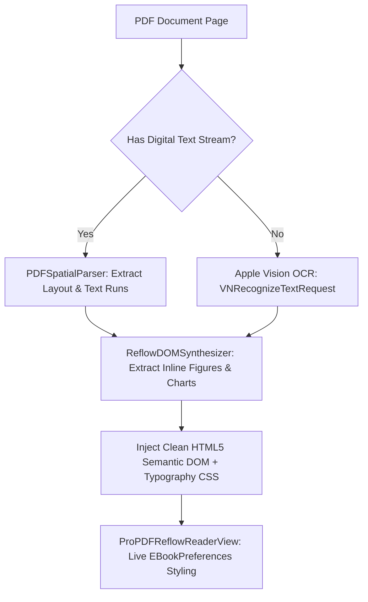

# InksyncPro Product Bible

**Last Updated:** August 17, 2026  
**Architecture Version:** Swift 6.0 Strict Concurrency • iOS 17.0+ • iPadOS 17.0+  
**Target Hardware:** iPhone 15/16 Pro, iPad Mini (8.3"), iPad Air (11"), iPad Pro (11" & 13" M4 120Hz ProMotion)

---

## Product Vision

InksyncPro is the premier, state-of-the-art iOS and iPadOS reading, conversion, and knowledge-synthesis ecosystem for comics, manga, digital EPUBs, and academic PDFs. It bridges the gap between distraction-free casual reading and high-performance, professional study and annotation. The application seamlessly harmonizes local sandboxes, iCloud ubiquity, and external cloud/drive storage without sacrificing 120Hz ProMotion fluidity, visual beauty, or zero-leak memory safety.

The core user experience philosophy: **the app should feel like a beautifully crafted, distraction-free home, not a utilitarian tool.** Every surface, glassmorphic container, typography scale, and gesture interaction is engineered to the highest Apple design standards.

---

## Master Architecture Protocol (Educator Synthesis)

```
┌─────────────────────────────────────────────────────────────────────────────────┐
│                           INKSYNC PRO KERNEL ARCHITECTURE                       │
├─────────────────────────┬───────────────────────────┬───────────────────────────┤
│    POINT-FREE SWIFT 6   │    KAVSOFT PROMOTION      │    PAUL HUDSON NATIVE     │
│   Strict Actor State    │   Glassmorphic 120Hz UX   │   PDFKit • WebKit • Pencil│
├─────────────────────────┼───────────────────────────┼───────────────────────────┤
│    THEPRIMEAGEN ZERO    │   VISUAL KERNEL STUDY     │   E-INK CLOUD PIPELINE    │
│  Zero-Leak Memory & JIT │ Zettelkasten • OCR Reflow │  Kindle Scribe • Colorsoft│
└─────────────────────────┴───────────────────────────┴───────────────────────────┘
```

1. **Point-Free Swift 6 State Architecture:** Single source of truth state management (`ReaderProgressTracker.shared`, `EBookPreferences.shared`, `AnnotationStore.shared`). Strict `@MainActor` UI boundaries and `Actor` background worker isolation with `Sendable` value semantics eliminate race conditions.
2. **Kavsoft UI/UX & ProMotion 120Hz Excellence:** Frosted-glass containers (`.ultraThinMaterial`, `Capsule()`, `RoundedRectangle`), curated dark/sepia/nord/cyberpunk color palettes, fluid gesture prioritization, and rich tactile `HapticEngine` feedback.
3. **Paul Hudson Native Framework Mastery:** Deep native integration of Apple frameworks: PDFKit (Smart Margin Cropping & Fit-Width expansion), WebKit (Multi-column full-bleed pagination), PencilKit (Non-blocking low-latency drawing layers), Vision (Neural OCR text extraction), and Metal graphics.
4. **ThePrimeagen Low-Level Performance & Zero-Leak Memory Safety:** JIT image decoding with aspect-fit downsampling, dynamic precache buffers, complete observer teardown (`dismantleUIView`, `deinit`), zero main-thread blocking, and `O(1)` memory disk streaming.
5. **Visual Kernel Mental Models & Study Systems:** Integrated Cornell note paper, relational Zettelkasten auto-linking (`ZettelkastenAutoLinker`), PARA method categorization, and Executive Summary HUD layers.

---

## Core Feature Systems

### 1. Library & iPad Multi-Tasking Architecture

- **Adaptive Bookshelf Grid:** Dynamic, geometry-aware responsive layout scaling automatically across devices:
  - *iPhone (Compact):* 2-column high-density card grid with compact margins and sheet presentation detents.
  - *iPad Mini (8.3") to iPad Pro (13"):* 3-to-7 column bookshelf grid taking full advantage of the enlarged screen real estate.
- **20-Page High-DPI Precache Buffer:** High-resolution asynchronous memory precaching optimized for 120Hz ProMotion scrubbing on iPad Pro hardware.
- **Side-by-Side Study Split Views:** Resizable split-screen layout pairing the reader canvas side-by-side with the Cornell Study Notebook and Zettelkasten drawers.
- **Apple Books-Style Content Shelves:** Persisted shelf selector strip (All / Comics / Manga / Books) with custom icons, badge counters, and animated selection capsules.
- **Smart Collections & Direct Folder Sorting:** Live dynamic filtering (Recently Added, Reading Now, Unread, Manga Mode, Completed) and alphabetical/chronological sorting that prevents empty folders from clustering at the top.

---

### 2. Spectacular & Effortless PDF Reflow Engine

The Pro PDF Reflow Engine converts dense, static, multi-column, or scanned PDF documents into an effortless, flowable reading experience that rivals native EPUBs.



- **Apple Vision Neural OCR Fallback:** Automatically invokes asynchronous on-device Vision OCR (`VNRecognizeTextRequest`) to extract structured headings, paragraphs, and lists from scanned books, historic papers, or image-only PDFs with zero digital text streams.
- **Inline Diagram & Figure Extraction:** `ReflowDOMSynthesizer` extracts visual figures, charts, and diagrams from the PDF coordinate space and synthesizes them directly inline with their associated paragraphs.
- **Real-Time Live Typography Synchronization:** Readers can freely customize font sizes, font families, line spacing, margins, and themes (Light, Sepia, Dark, OLED Black, Nord) with instant DOM style updates without losing position.

---

### 3. App Store Gold-Standard EPUB Reader Suite

Engineered to match and exceed the stability, typography fidelity, and responsiveness of Apple Books and Amazon Kindle.

- **Fractional Scroll Position & Reading Anchor Preservation:** Dynamic JavaScript continuous scroll calculation (`0.0`–`1.0`) ensures that when readers adjust font sizes (e.g. 14pt → 24pt), change font families, or rotate between portrait and landscape, the reader stays on the exact same paragraph with **zero position drift**.
- **0ms Intra-Chapter Anchor Column Jumps:** In-page fragment navigation (`#section-3`, `#chapter-2`) calculates the exact horizontal column offset (`Math.floor(offsetLeft / colWidth)`) and jumps instantly via `goToInksyncPage`, eliminating layout-breaking vertical `scrollIntoView()`.
- **Non-Destructive Interactive Footnote HUD:** Tapping footnote references (`[1]`, `*`, `†`) displays a compact, glassmorphic popover card (`.presentationCompactAdaptation(.popover)`) with haptic feedback, allowing users to read annotations without leaving the page.
- **Backward Chapter Navigation Sentinel (`99999`):** When navigating backward from Chapter $N$ to Chapter $N-1$, a sentinel signal (`99999`) prompts WebKit to resolve the true column count via `computeMetrics()`, commit `translateX(-shift)`, unhide the web view, and mount the exact final page controller.
- **Publisher Style Reset & Dark/Sepia Immunity:** Injected DOM normalizers aggressively cleanse hardcoded publisher background colors (`<p style="background:#fff">`) while strictly preserving code blocks, tables, and user highlights.
- **Physical Spine Median Shadow Depth:** Dual-page landscape reading on iPad renders a subtle, realistic median fold shadow replicating the physical depth of a bound book.

---

### 4. Vector PDF Reader & Zero-Freeze Safeguards

- **Overlay Hit-Testing Isolation:** All full-screen overlay containers (`FloatingReaderClockOverlay`, `showZoomPill`, `ReadingJumpToastOverlay`, scanning HUDs) are strictly configured with `.allowsHitTesting(false)` on background spacers, ensuring that floating indicators never block touches, page turns, or gestures on the underlying document.
- **Reading Jump Toast Capsule:** The "Jumped to Page X" toast isolates hit-testing strictly to the interactive button card, keeping the upper 90% of the reader canvas completely responsive.
- **Background Thumbnail & Image Offloading:** PDF page thumbnails and image rendering are handled off the main run loop to eliminate UI hitches.
- **Smart Auto-Crop & Manual Trimming:** Automatic edge-detection removes margins to maximize reading area, paired with the interactive `ProCropAdjustmentSheet` visual slider tool.

---

### 5. E-Ink Conversion & Sideloading Pipeline

#### Resolution-Aware Device Profiles (`EInkOptimizer`)

| Device | Resolution | PPI | Target Profile |
| :--- | :--- | :--- | :--- |
| **Kindle Scribe Colorsoft 11"** | 1980 × 2640 px | 300 PPI | Primary E-Ink Target |
| **Kindle Scribe Colorsoft 7"** | 1264 × 1680 px | 300 PPI | Portable Scribe |
| **Kindle Paperwhite** | 1236 × 1648 px | 300 PPI | Standard E-Reader |
| **Kobo Elipsa / Boox Note Air** | 1404 × 1872 px | 227 PPI | Open Android / Kobo |

#### Kindle EPUB Compliance Standard
All generated EPUBs conform strictly to Amazon's Send to Kindle (KFX) and sideloading (AZW3) validator rules:
- Viewport declared via `<meta name="viewport" content="width=1980, height=2640"/>` (**NO `initial-scale=1.0`**).
- No forbidden CSS (`position: fixed`, `overflow: hidden`, `@page { size }`, `@media amzn-*`).
- Sequential Floyd-Steinberg 16-level error diffusion dithering for smooth grayscale transitions without banding.
- Srgb standard color space enforcement preventing wide-gamut (P3) rendering panics.

---

### 6. Study Notebook & Relational Zettelkasten Suite

- **Cornell 3-Zone Paper Templates:** Digital paper styles supporting Ruled (`24pt`), College Ruled (`21pt`), and Legal (`28pt`) rule baselines in ivory yellow (`#FFFDF0`) and charcoal themes.
- **Relational Obsidian Vault Exporter:** Packages notes, quotes, and metadata into a nested Obsidian vault structure, pre-rendering PencilKit drawings into transparent PNGs with wiki-links.
- **PARA Method (Tiago Forte):** First-class classification into Projects (🚀), Areas (🏡), Resources (📚), and Archives (📦).
- **Adler Semantic Marginalia:** Instant shorthand tagging (`? Question`, `! Insight`, `★ Core Thesis`, `≠ Counter-Argument`, `Δ Logic Shift`).

---

## Technical Specifications & Concurrency Rules

```swift
// Swift 6 Strict Concurrency Architecture Pattern
@MainActor
final class UnifiedReaderState: ObservableObject {
    @Published var activePage: Int = 0
    @Published var isChromeVisible: Bool = false
    
    // Background heavy lifting offloaded to actors
    func performBackgroundAnalysis(for documentID: UUID) {
        Task.detached(priority: .userInitiated) {
            let result = await DocumentAnalysisActor.shared.analyze(documentID)
            await MainActor.run {
                self.applyResult(result)
            }
        }
    }
}
```

| Invariant | Standard | Enforcement |
| :--- | :--- | :--- |
| **State Mutation** | Single Source of Truth | `ReaderProgressTracker.shared`, `AnnotationStore.shared` |
| **Main Thread Safety** | `@MainActor` UI Isolation | All SwiftUI views and UIKit representables run on `@MainActor` |
| **Heavy I/O & Parsing** | Background Actor Isolation | Archive decompression and OCR parsing run on `Task.detached` |
| **Memory Buffer Cap** | LRU `NSCache` $\le$ 20 Pages | Prevents Jetsam memory kills on high-DPI spreads |
| **File Sandbox Scope** | Security-Scoped Bookmarks | Explicit `startAccessingSecurityScopedResource()` lifecycle |
| **Observer Teardown** | Clean `dismantleUIView` | Unregister all notification observers on view deinit |

---

## File Structure & Module Map

```
InksyncPro/
├── Services/
│   ├── Core/           # InstallGuard, ZipUtilities, EBookParser, NarrationEngine
│   ├── Reader/         # JITComicCacheEngine, PageOCRService, ReaderUtilities
│   ├── Reflow/         # PDFSpatialParser, ReflowDOMSynthesizer
│   ├── State/          # ReaderProgressTracker, EBookPreferences, ReadingJumpTracker
│   └── Network/        # CloudDownloadManager, ActiveUploadRegistry
├── Views/
│   ├── Library/        # LibraryGridView, ReadNowTabView, DualExportView
│   ├── Reader/         # ProPDFReaderEngine, EBookPageCurlReader, ComicReaderEngine
│   │   └── Components/ # ProCropAdjustmentSheet, HyperlinkPreviewHUD, FloatingReaderClockOverlay
│   ├── Conversion/     # ConvertView, EInkOptimizer, ArchiveMutatorService
│   └── Study/          # StudyNotebookView, GlobalZettelkastenHubView, CorkboardView
└── Models/             # LibraryItem, Annotation, CodableCropInsets, ReadingStreak
```

---

## Deployment & Verification Baseline
- **Point of Truth Commit**: `078235e` (Permanent Baseline Tag)
- **Active Release Branch**: `ios-port`
- **Compiler Status**: 0 Errors, 0 Concurrency Warnings (Swift 6 Strict Mode)
